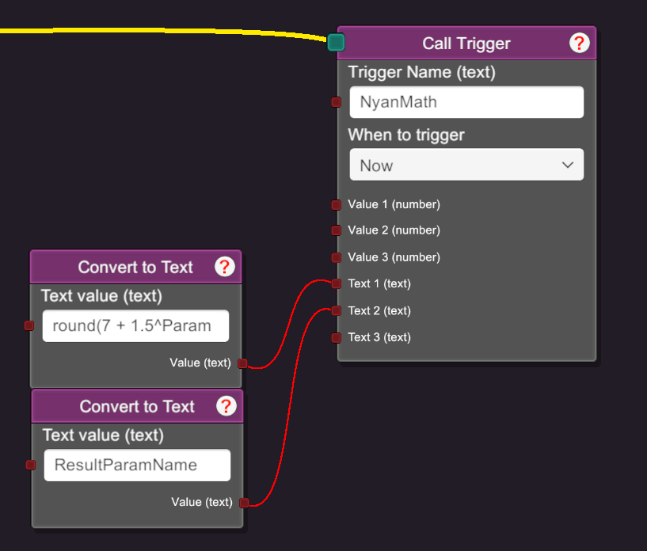

# NyanMath
Adds advanced math expression evaluation capabilities to VNyan.

## Usage
To use from within a node graph, call the `NyanMath` trigger (case-sensitive) with the following values:
- **Text 1 (required):** The expression to evaluate (more info below).
- **Text 2:** The name of a parameter to store the result in. If not provided, it will default to `NyanMathResult`.

Make sure to pay special attention to the "when to trigger" setting.
If you're trying to use the result of the operation in an ordered execution setting, you should set it to "Now";
otherwise, the operation will be delayed until the next frame.

- 

## Expression syntax
Most standard math operators and expressions are supported, including:
- `+`, `-`, `*`, `/`, `%` (modulo), `^` (exponentiation)
- Parentheses for grouping
- Function calls to many functions from the `System.Math` assembly (see below)
- Constants like `pi` and `e`
- Variables (VNyan decimal parameters) can be used in expressions

### Supported functions
The following functions from the `System.Math` assembly are supported:
- `round(x)`
- `floor(x)`
- `ceil(x)`
- `abs(x)`
- `sqrt(x)`
- `log(x, base)`
- `min(x, y)`
- `max(x, y)`
- `pow(x, y)` (equivalent to the expression `x^y`)
- `sign(x)`
- `sin(x)`, `cos(x)`, `tan(x)`
- `asin(x)`, `acos(x)`, `atan(x)`
- `atan2(y, x)`
- `sinh(x)`, `cosh(x)`, `tanh(x)`
- `clamp(x, min, max)`

### Error handling
If an error occurs while parsing or evaluating the expression, the text parameter
`NyanMathError` will be set to a non-empty value with a description of the error.

After a successful evaluation, the `NyanMathError` text parameter will be set to an empty string,
and either the parameter name specified in `Text 2` will be set to the result (if provided),
or the default `NyanMathResult` parameter will be set.

## License
This plugin is licensed under the MIT license.
See the [LICENSE](LICENSE) file for more information.

### Contributing
Contributions are welcome! Feel free to open an issue or submit a pull request.
